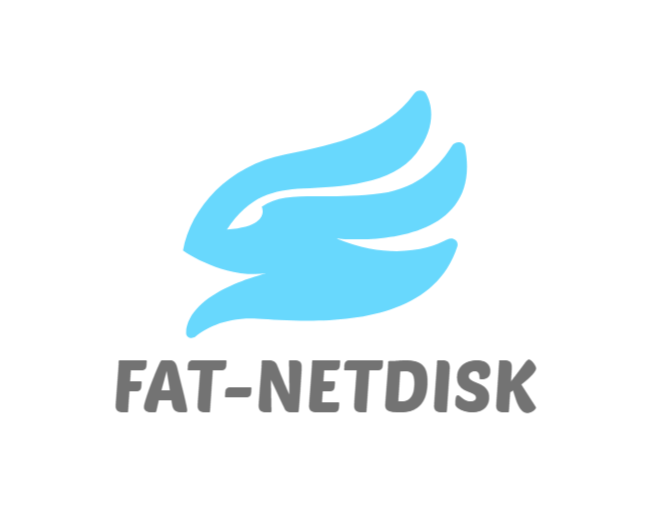

 

<h1>Fat-NetDisk</h1>

Fat-NetDisk is a web-based file manager, written mainly in TypeScript and Golang

[简体中文](./README.md) | English

# 🎉Features

* [x] Grid view and list view support
* [x] Connect to 7Niu cloud for file storage and download
* [x] Multi-file download and deletion
* [x] Accurate display and sorting of file and folder sizes and modification dates
* [x] Drag-and-drop selection in both list view and grid view
* [x] Top button and breadcrumb navigation jumps
* [x] Transfer list progress bar display
* [x] Quickly search for files in your network drive and display search results
* [x] Add various formats of file preview functions such as pictures, videos, pdf
* [x] User module (login registration, jwt authentication, token timing update)、
* [x] Preview video of the Sprite chart

# 📌Todo

* [ ] Transfer completion page
* [ ] Multi-file upload and folder download
* [ ] Slider form of login registration verification method
* [ ] Batch fast copy files
* [ ] Large file size upload
* [ ] Refactoring to a desktop application with Tauri

# 💎Demo

# 🎈License

Fat-NetDisk using [MIT License]